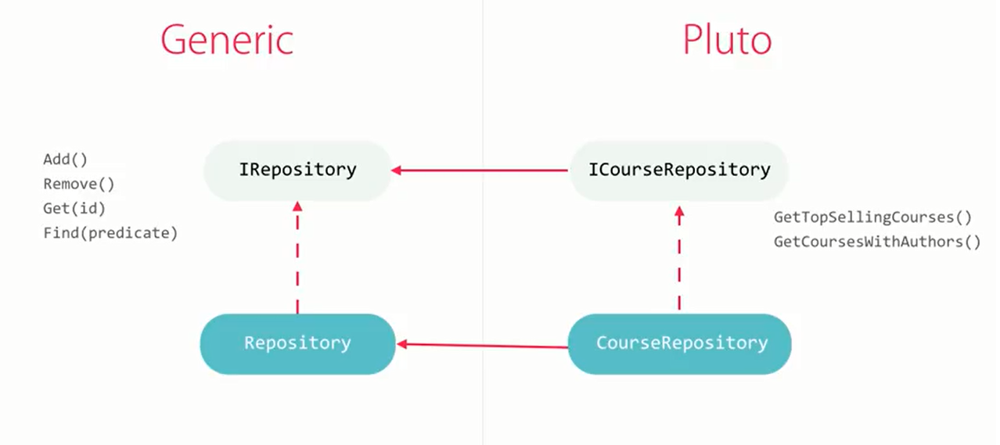

## Demo of repository pattern with C# and Entity Framework

## About This Demo
```
|-- ORM  
	|-- Generic  
	|-- Application  
```

For above folder structure:

- Generic, the Generic folder contains two code files `IRepository` and `Repository`, these are files that are independent to our application, meaning you could copy it to your own project.
- Application, the Application folder contains EntityReposity and UnitOfWork that are related to our application, we make Course entity as a sample, you could follow this pattern to add your own Entity Repository and UnitOfWork code for your own project.

See following code in `WebServiceDB.asmx.cs` about how to use:
```csharp
        [WebMethod]
        public string TestORMRepositoryPattern()
        {
            using (var unitOfWork = new ORM.Application.UnitOfWork(new testEntities()))
            {
                //get example
                var course = unitOfWork.Courses.Get(1);
                var allCourses = unitOfWork.Courses.GetAll();             

                var courses = unitOfWork.Courses.GetCoursesWithAuthors(1, 10);

                //update example
                course.Abstract = "course 1 - abstract";
                unitOfWork.Complete();

                return string.Empty;
            }

        }
```

## Repository Pattern Explanation in-depth
Benifits
- Minimizes duplicate query logic
- Decouples your application from persistence frameworks, there will be a new ORM framework every 2 years.
- Promotes testability

What is a repository pattern
a repository pattern implements following methods to manuplicate data.
```
Add(obj)
Remove(obj)
Get(id)
GetAll()
Find(predicate)
```

**Minimize duplicate query logic**
In EF:
```
var topSellingCourses = context.Courses
.where(c => c.IsPublic  && c.IsApproved)
.OderByDescending(c => c.Sales)
.Take(10);
```

Repository:
```
var courses = repository.GetTopSellingCourses();
```

## Implement a Repository Pattern

Generic Code that are independent to our applications, which means different applications could leverage it without changing anything.

IRepository
```
Add()
Remove()
Get(id)
Find(predicate)
```

Repository implements IRepository. Repository has a property of DBContext.

Application associated code:
ICourseRepository inherits from IRepository, it defines some methods that special to our application besides the general add, get, etc. for example:
```
GetTopSellingCoures()
GetCoursesWithAuthors()
```

CourseRepository implements ICourseRepository and Repository<Course>, it ahs a propery of DBContext related to our application.


IUnitOfWork
```
ICourseRepository Courses{get;}
IAuthorRepository Authors{get;}
void Complete()
```
UnitOfWork implements IUnitOfWork

